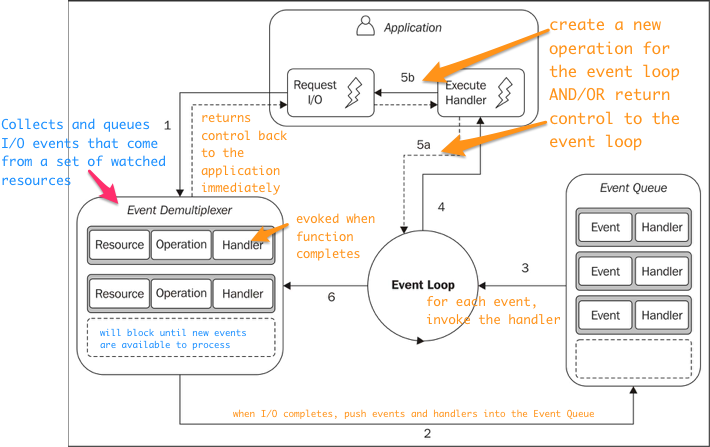

# Event Demultiplexing

Many modern OS provide a mechanism to handle concurrent non-blocking resources in an efficient way, known as the **synchronus event demultiplexer** (also known as the **event notification interface**).

**Multiplexing** refers to "multiple signals being combined into one, so they can be easily transmitted over a medium with limited capacity".

**Demultiplexing** refers to the opposite opereation, where the signals are split again to its original components.

# The Reactor Pattern

The main idea behind the reactor pattern is to have a handler associated with each I/O operation. A handler in Node.js is represented by a callback (cb) function. Any given handler will be invoked as soon as an event is produced and processed by the event loop.

The asynchronus behavior of node.js is portrayed in the diagram above. A node.js application accesses a resource at one point in time (wihtout blocking) and provides a handler, which will be invoked at another point in time whe nthe operation completes.

# The Pattern at the Heart of Node.js
>The Reactor Pattern Handles I/O by blocking until new events are available from a set of observed resources, and then reacts by dispatching each event to an associated handler.

# Libuv, the I/O engine of Node.js

Different operating systems on different computers have unique interfaces for event demultiplexing. This creates inconsistences across and within different OS. Because of this, the Node.js core time created a native library called **libuv**, with the objective to allow Node.js to be used on *any* OS with normalized non-blocking behavior. **Libuv is the I/O engine of Node.js and is the most important component that Node.js is built on.** Libuv
- implements the reactor pattern
- provides an api for creating event loops
- provides an api for managing event queues
- provides an api for async I/O operations 

# The Recipe for Node.js

- We need a set of bindings to expose libuv and other low-level functionality to javascript 
- **V8**, the js engine originally developed by google for chrome. **V8** is a big reason why node.js is so fast.
- Core js library to implement high level node.js API.

# JS in Node.js

